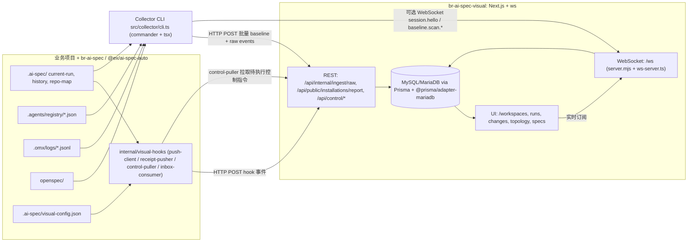
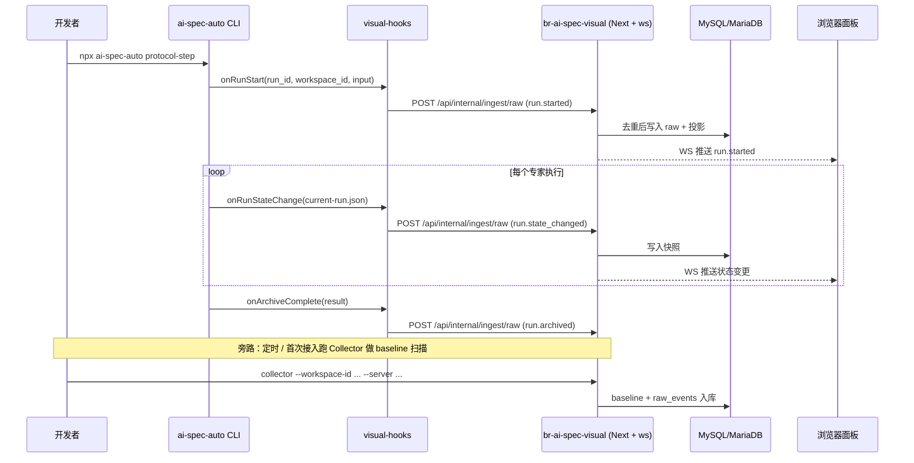

# 与 br-ai-spec 协作与技术栈

> 本文系统梳理 `br-ai-spec-visual`（可视化/控制面，本仓）与 `br-ai-spec`（npm 包 `@ex/ai-spec-auto`，规范与运行时底座）之间的角色分工、通信通道、数据传输契约与各自技术栈。
>
> 兄弟仓默认路径：`../br-ai-spec`（即 `/Users/lizhenwei/workspace/vueworkspace/bairong/br-ai-spec`）。

补充一个更完整的上游关系：

- `skill-q-platform`：Hub 平台，维护 registry（注册表）主数据和导出
- `br-ai-spec`：消费 Hub 导出，写入项目本地 `.agents/registry`
- `br-ai-spec-visual`：优先展示数据库里的 `RegistryItem`；只有没有数据库结果时才回退读本地 `.agents/registry`

因此 Visual 里的 registry 真相优先级是：

```text
数据库 RegistryItem（通常来自 Hub/CLI 同步） > 本地 .agents/registry fallback
```

三仓协同总说明见：
[Hub-CLI-Visual三仓协同说明](../../br-ai-spec/docs/four/Hub-CLI-Visual三仓协同说明.md)

## 1. 两仓库角色定位

- **`br-ai-spec`（npm: `@ex/ai-spec-auto`）**：规范与运行时**底座**。提供规则、技能、IDE 命令、OpenSpec 流程，并在协议推进时维护 `.ai-spec/` 运行态、`.agents/registry/` 角色注册表、`.omx/logs/` 日志、`openspec/` 规范资产；通过内置 `internal/visual-hooks/` 把关键事件**主动推送**给 visual。
- **`br-ai-spec-visual`（本仓）**：可视化与**接入层 / 控制面**。提供 Workspaces、Runs、Changes、拓扑、规格视图与认证；同时提供 **REST + WebSocket** 服务和 **Collector CLI**，把多项目运行态汇总到统一面板。

口诀：**业务项目跑 ai-spec-auto 完成规范闭环 → visual 通过 Hook + Collector 把数据汇总展示。**

## 2. 通信通道总览

两侧通过四条互补通道协作（全部以 visual 为服务端）：



通道职责：

- **Hook 推送（auto → visual，实时）**：`internal/visual-hooks/push-client.js` 在 `run.started / run.state_changed / run.archived` 等节点 `POST /api/internal/ingest/raw`，HTTP，超时即降级，**不阻塞**协议推进。
- **Collector 批量上报（visual 自带 CLI → visual，按需/定时）**：[src/collector/cli.ts](../src/collector/cli.ts) 扫描业务项目的 `.ai-spec/`、`.agents/registry/`、`.omx/logs/`、`openspec/`，HTTP 批量 `POST /api/internal/ingest/raw`，可选 WebSocket 推 `session.hello / baseline.scan.started / baseline.scan.completed`。
- **控制回执（visual → auto，反向）**：visual 侧 `/api/control/pending|approve|resume`，auto 侧 `internal/visual-hooks/control-puller.js` 轮询拉取，再用 `receipt-pusher.js` 回 ingest 事件。
- **浏览器实时（visual UI ↔ visual）**：[server.mjs](../server.mjs) 用 `ws` 在同端口挂 `/ws`，UI 订阅事件流。

## 3. 数据传输契约

### 3.1 配置入口（auto 侧）

`.ai-spec/visual-config.json`（示例见 `../br-ai-spec/.ai-spec/visual-config.example.json`）：

```json
{
  "enabled": true,
  "visual_url": "http://localhost:3000",
  "workspace_id": "my-project",
  "push_mode": "hook",
  "push_timeout_ms": 3000,
  "retry_times": 1
}
```

可被环境变量 `AI_SPEC_VISUAL_ENABLED / AI_SPEC_VISUAL_URL / AI_SPEC_VISUAL_WORKSPACE_ID / AI_SPEC_VISUAL_PUSH_TIMEOUT_MS` 覆盖。

### 3.2 统一摄取端点

实现：[src/app/api/internal/ingest/raw/route.ts](../src/app/api/internal/ingest/raw/route.ts)。同时兼容两种入参：

- **Collector 形态**（snake_case）：`{ workspace_id, agent_id, connect_token, source_kind, root_path, raw_events: [...] }`
- **Hook/Receipt 形态**（camelCase + Header）：Header `X-Workspace-ID`、`X-Connect-Token`，Body `{ sourceKind, workspaceId, rawEvents: [...] }`

`connect_token` 缺省时按本地受信任来源处理；存在时用 `REALTIME_CONNECT_SECRET` 做 HMAC 校验，校验失败仅记日志，不阻断 ingest。

### 3.3 raw_event 单条结构

由 [src/collector/raw-events.ts](../src/collector/raw-events.ts) 与 `../br-ai-spec/internal/visual-hooks/README.md` 共同约定：

- `sourceKind`：`registry` / `omx-jsonl` / `run-state-json` / `repo-map-json` / `hook-event` / `control-receipt`
- `sourcePath`、`eventType`、`eventKey`、`dedupeKey`、`checksum`、`occurredAt`
- `entityType` / `entityId`、`payload`

去重：服务端按 `dedupeKey` 命中即 `skipped`，否则 `inserted` 并触发投影到 Prisma 数据库与 UI 投影。

### 3.4 已知 eventType

- 来自 hook：`run.started`、`run.state_changed`、`run.archived`
- 来自 Collector：`role.registered`、`skill.registered`、`flow.registered`、`runtime-state.snapshot`、`repo-map.snapshot`、`omx.log.entry`
- 来自 WebSocket 握手：`session.hello`、`session.ack`、`baseline.scan.started`、`baseline.scan.completed`

### 3.5 Collector 命令面

实现：[src/collector/cli.ts](../src/collector/cli.ts)、HTTP 适配 [src/collector/http-transport.ts](../src/collector/http-transport.ts)、WS 适配 [src/collector/transport.ts](../src/collector/transport.ts)。

```bash
br-ai-spec-visual-collector \
  --workspace-id my-project \
  --project /path/to/auto-project \
  --server http://localhost:3000 \
  [--connect-token <token>] [--agent-id ...] [--json]
```

## 4. 技术栈对照

### 4.1 br-ai-spec-visual（本仓）

- **运行时/框架**：Node 18+；Next.js 16.2 (App Router)；自定义 [server.mjs](../server.mjs)（`http` + `next` + `tsx/esm/api` 加载 `src/server/ws-server.ts`）；React 19；TypeScript 5。
- **UI**：Tailwind CSS 4、`clsx` / `tailwind-merge` / `class-variance-authority`、`lucide-react`、`@xyflow/react`（拓扑图）。
- **数据**：Prisma 7.7（`prisma/prisma.config.ts`，`provider="mysql"`），运行时 `@prisma/adapter-mariadb` + `mariadb` 驱动；Zod 4 校验。
- **认证安全**：`bcryptjs`；Cookie + 服务端会话；`BR_AI_SPEC_VISUAL_*` 环境变量；`REALTIME_CONNECT_SECRET` 用于 ingest/WS HMAC。
- **实时与集成**：`ws`（与 HTTP 同端口）；Collector CLI 用 `commander` + `chokidar` + `glob` + `tsx`。
- **工具**：`date-fns`、`nanoid`。
- **质量**：ESLint 9 + `eslint-config-next`；Vitest 4 + `@testing-library/*` + `jsdom`。
- **部署**：Docker / docker-compose（`docker-compose.yml`、`Dockerfile`）。

### 4.2 br-ai-spec / @ex/ai-spec-auto（兄弟仓）

- **形态**：Node CLI + 规则/技能/OpenSpec 资产仓；通过 `npx @ex/ai-spec-auto init .` 注入到业务项目。
- **运行产物**：`.ai-spec/`（current-run、history、repo-map）、`.agents/registry/`、`.omx/logs/`、`openspec/specs|changes`。
- **集成层**：纯 JS（ESM）`internal/visual-hooks/`：`config-loader.js`、`push-client.js`、`receipt-pusher.js`、`control-puller.js`、`inbox-consumer.js`、`index.js`。
- **配置**：`.ai-spec/visual-config.json` + `manifest.json`（profile/roles/skills/rules）。
- **多 IDE 适配**：`.cursor/`、`.claude/`、`.opencode/`、`.trae/`、`.agents/`、`.omc/`。

## 5. 端到端时序示例（典型一次 protocol-step）



## 6. 关联文档

- [Collector 使用指南](Collector使用指南.md)
- [BR AI Spec Visual 部署指南](BR%20AI%20Spec%20Visual%20部署指南.md)
- 兄弟仓 hook 说明：`../br-ai-spec/internal/visual-hooks/README.md`
- 兄弟仓集成实施报告：`../br-ai-spec/集成实施报告.md`
